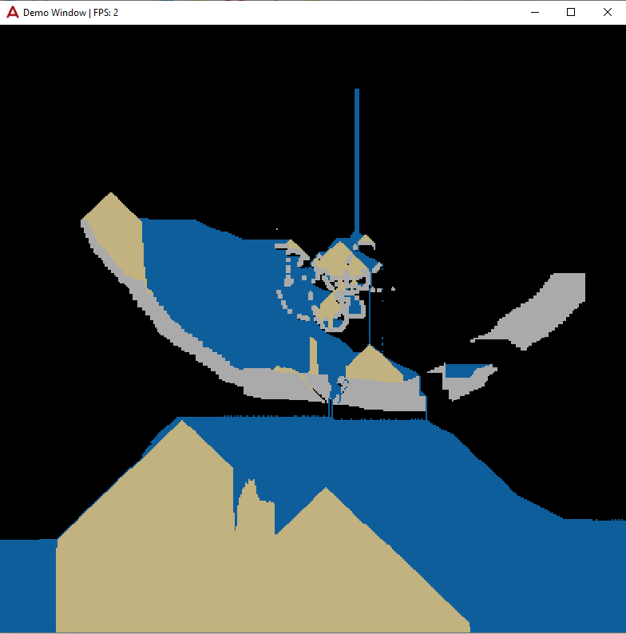

Stopped working on project on 2020-06-28. Here are some screenshots of what was finished:

Image of water, sand and concrete particles in the game.


Left off trying to make game multiplayer (open two windows and sand will appear in both interactively).

# Base Windows

## TODO

- change input system (allow for single clicks)
- implement new particles + particle generator
- create terraria clone
  - create expandable map
  - create player
    - can interact with world x squares from player with mouse

### How to use:

```

```
